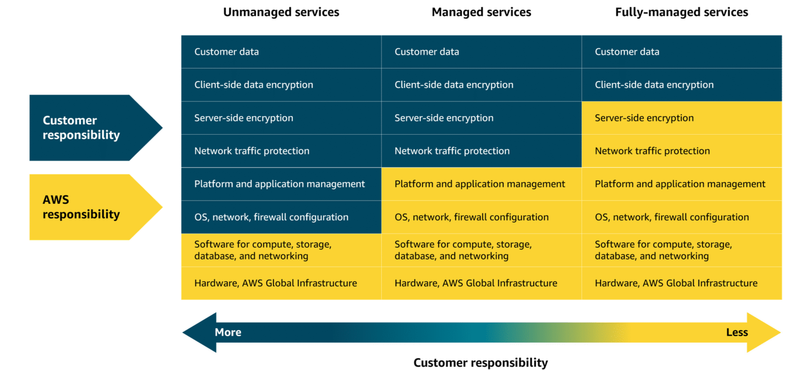

## EC2

### EC2 Naming convention
https://docs.aws.amazon.com/ec2/latest/instancetypes/instance-type-names.html

### Savings Plan
https://docs.aws.amazon.com/savingsplans/latest/userguide/what-is-savings-plans.html

### Reserve compute capacity with EC2 On-Demand Capacity Reservations
https://docs.aws.amazon.com/AWSEC2/latest/UserGuide/ec2-capacity-reservations.html

Routing methods 

To optimize traffic distribution, ELB uses several routing methods: Round Robin, Least Connections, IP Hash, and Least Response Time. These routing strategies work together for efficient traffic management and optimal application performance.

Round Robin
Distributes traffic evenly across all available servers in a cyclic manner.

Least Connections
Routes traffic to the server with the fewest active connections, maintaining a balanced load.

IP Hash
Uses the client’s IP address to consistently route traffic to the same server.

Least Response Time
Directs traffic to the server with the fastest response

ELB and Auto Scaling work together to efficiently manage varying levels of demand. ELB is responsible for distributing incoming traffic evenly across multiple EC2 instances. This makes sure that no single instance becomes overwhelmed. It also serves as a single-entry point for traffic into an Auto Scaling group, directing requests to the appropriate resources.

Meanwhile, Auto Scaling automatically adjusts the number of EC2 instances based on the demand. It adds or removes instances as needed for optimal performance and resource usage. Together, ELB and Auto Scaling help maintain application reliability and cost efficiency.

Messaging and Queuing 

Amazon EventBridge, Amazon SNS, and Amazon SQS are AWS services that help different parts of an application communicate effectively in the cloud. These services support building event-driven and message-based systems. Together, they help create scalable, reliable applications that can handle high traffic and can enhance communication between components.

EventBridge

EventBridge is a serverless service that helps connect different parts of an application using events, helping to build scalable, event-driven systems. With EventBridge, you route events from sources like custom apps, AWS services, and third-party software to other applications. EventBridge simplifies the process of receiving, filtering, transforming, and delivering events, so you can quickly build reliable applications.

How EventBridge helps: EventBridge can route events, like order placed or payment completed, to the relevant services (payment, restaurant, inventory, and delivery). It can handle high volumes of events during peak times, making sure each service works independently. Even if one service fails, EventBridge will store the event and process it as soon as the service is available again. EventBridge helps provide a smooth and reliable operation across the entire system.

Amazon SQS (simple queue service)

Amazon SQS is a message queuing service that facilitates reliable communication between software components. It can send, store, and receive messages at any scale, making sure messages are not lost and that other services don't need to be available for processing. In Amazon SQS, an application places messages into a queue, and a user or service retrieves the message, processes it, and then removes it from the queue.

To improve efficiency, they implement a queue system using Amazon SQS. The support agent adds customer issues to the queue, creating a backlog. Even if the specialist is busy, the agent can continue adding new issues. The specialist checks the queue, resolves issues, and updates the agent. This system provides a smooth workflow and helps handle higher volumes without delays or bottlenecks.

Amazon SNS
Amazon SNS is a publish-subscribe service that publishers use to send messages to subscribers through SNS topics. In Amazon SNS, subscribers can include web servers, email addresses, Lambda functions, and various other endpoints. You will learn about Lambda in more detail later

Summary
In tightly coupled systems, components are heavily interdependent. If one component fails, it can cause cascading failures. In contrast, loosely coupled systems have components that operate independently, so the failure of one component does not disrupt the entire system.

Amazon SQS safely stores transaction details until the next service can process them, preventing data loss when the service is unavailable.

Lambda

Lambda is a serverless compute service that runs code in response to events without the need to provision or manage servers. It automatically manages the underlying infrastructure, scaling resources based on the volume of requests. You are charged only for the compute time consumed, down to the millisecond. Lambda handles execution, scaling, and resource allocation. You can optimize performance by configuring the appropriate memory size for your function.

Containers

Code
Cnfigurations
Dependencies
Runtime

Flow of using Services

ECR (Elastic container registry)
ECS or EKS (Elastic container service) or (Elastic Kubernetes Service)
Compute option : Ec2 or Fargate(serverless)

Amazon ECS

Amazon Elastic Container Service (Amazon ECS) is a scalable container orchestration service for running and managing containers on AWS, like Docker containers. Docker is a software platform for building, testing, and deploying applications quickly.

Amazon ECS launch types

Amazon ECS with Amazon EC2 is ideal for small-to-medium businesses that need full control over infrastructure. Suitable for custom applications requiring specific hardware or networking configurations, with the flexibility of Amazon EC2 and the simplicity of Amazon ECS.

Amazon ECS with AWS Fargate is perfect for startups or small teams building web applications with variable traffic. It's a serverless option—no server management required—so teams can focus on development while Amazon ECS handles scaling and orchestration.

Amazon EKS

Amazon Elastic Kubernetes Service (Amazon EKS) is a fully managed service for running Kubernetes on AWS. It simplifies deploying, managing, and scaling containerized applications using open-source Kubernetes, with ongoing support and updates from the broader community.

Amazon EKS launch types

Amazon EKS with Amazon EC2: This is best for enterprises needing full control over infrastructure. It offers deep customization of EC2 instances alongside Kubernetes scalability—ideal for complex, large-scale workloads.

Amazon EKS with AWS Fargate: This is great for teams wanting Kubernetes flexibility without managing servers. It combines Kubernetes power with serverless simplicity, helping to scale applications quickly across various use cases.

Amazon ECR

Amazon Elastic Container Registry (Amazon ECR) is where you can store, manage, and deploy container images. It supports container images that follow the Open Container Initiative (OCI) standards. You can push, pull, and manage images in your Amazon ECR repositories using standard container tooling and command line interfaces (CLIs).

#### Additional compute services

AWS offers purpose-built services for specific needs, such as streamlining web application deployment, managing batch workloads, providing virtual servers, and extending cloud infrastructure to on-premises data centers.

Elastic Beanstalk

Elastic Beanstalk is a fully managed service that streamlines the deployment, management, and scaling of web applications. Developers can upload their code, and Elastic Beanstalk automatically handles the provisioning of infrastructure, scaling, load balancing, and application health monitoring. It supports various programming languages and frameworks, such as Java, .NET, Python, Node.js, Docker, and more. It provides full control over the underlying AWS resources while automating many operational tasks.

Good for: Deploying and managing web applications, RESTful APIs, mobile backend services, and microservices architectures, with automated scaling and simplified infrastructure management

AWS Batch

AWS Batch is a fully managed service that you can use to run batch computing workloads on AWS. It automatically schedules, manages, and scales compute resources for batch jobs, optimizing resource allocation based on job requirements.

Good for: Processing large-scale, parallel workloads in areas like scientific computing, financial risk analysis, media transcoding, big data processing, machine learning training, and genomics research

Lightsail

Amazon Lightsail is a cloud service offering virtual private servers (VPSs), storage, databases, and networking at a predictable monthly price. It’s ideal for small businesses, basic workloads, and developers seeking a straightforward AWS experience without the complexity of the full AWS Management Console.

Good for: Basic web applications, low-traffic websites, development and testing environments, small business websites, blogs, and learning cloud services

Outposts

AWS Outposts is a fully managed hybrid cloud solution that extends AWS infrastructure and services to on-premises data centers. It provides a consistent experience between on premises and the AWS Cloud, offering compute, storage, and networking components.

Good for: Low-latency applications, data processing in remote locations, migrating and modernizing legacy applications, and meeting regulatory compliance or data residency requirements

#### Choosing AWS Region

Compliance

Compliance is an important consideration when selecting Regions for deploying business resources. Different geographical locations have varying regulatory requirements and data protection laws that organizations must follow. For example, the General Data Protection Regulation (GDPR) is designed to protect the personal data and privacy of individuals within the European Union (EU). An online retail company operating in the EU would be required to meet GDPR compliance to protect customer data. GDPR compliance includes obtaining proper consent for data collection and providing mechanisms for data access and deletion.

Proximity

When selecting a Region, you also want to consider how to achieve low latency for your users. Regions closer to your user base minimize data travel time, which reduces latency and enhances application responsiveness. Choosing a Region or set of Regions farther away from customers could introduce delays, which might impact user satisfaction and overall system efficiency.

Feature availability

You also want to consider which specific features and services are available in each Region. AWS is constantly expanding features and services to multiple locations, but not all Regions contain all AWS offerings. For example, AWS GovCloud Regions are specifically designed to meet the compliance and security requirements of US government agencies and their contractors. These Regions have stringent physical, operational, and personnel security controls in place. These controls are only available in specific Regions to meet certain governmental regulatory requirements.