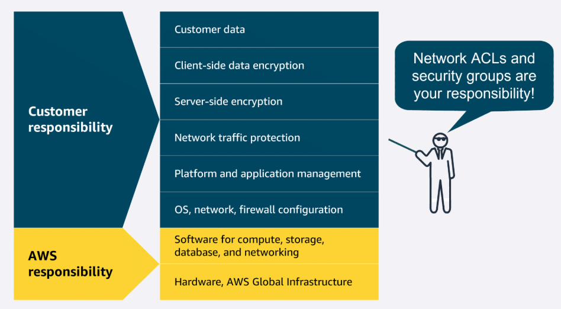

## EC2

### EC2 Naming convention
https://docs.aws.amazon.com/ec2/latest/instancetypes/instance-type-names.html

### Savings Plan
https://docs.aws.amazon.com/savingsplans/latest/userguide/what-is-savings-plans.html

### Reserve compute capacity with EC2 On-Demand Capacity Reservations
https://docs.aws.amazon.com/AWSEC2/latest/UserGuide/ec2-capacity-reservations.html

Routing methods 

To optimize traffic distribution, ELB uses several routing methods: Round Robin, Least Connections, IP Hash, and Least Response Time. These routing strategies work together for efficient traffic management and optimal application performance.

Round Robin
Distributes traffic evenly across all available servers in a cyclic manner.

Least Connections
Routes traffic to the server with the fewest active connections, maintaining a balanced load.

IP Hash
Uses the client’s IP address to consistently route traffic to the same server.

Least Response Time
Directs traffic to the server with the fastest response

ELB and Auto Scaling work together to efficiently manage varying levels of demand. ELB is responsible for distributing incoming traffic evenly across multiple EC2 instances. This makes sure that no single instance becomes overwhelmed. It also serves as a single-entry point for traffic into an Auto Scaling group, directing requests to the appropriate resources.

Meanwhile, Auto Scaling automatically adjusts the number of EC2 instances based on the demand. It adds or removes instances as needed for optimal performance and resource usage. Together, ELB and Auto Scaling help maintain application reliability and cost efficiency.

Messaging and Queuing 

Amazon EventBridge, Amazon SNS, and Amazon SQS are AWS services that help different parts of an application communicate effectively in the cloud. These services support building event-driven and message-based systems. Together, they help create scalable, reliable applications that can handle high traffic and can enhance communication between components.

EventBridge

EventBridge is a serverless service that helps connect different parts of an application using events, helping to build scalable, event-driven systems. With EventBridge, you route events from sources like custom apps, AWS services, and third-party software to other applications. EventBridge simplifies the process of receiving, filtering, transforming, and delivering events, so you can quickly build reliable applications.

How EventBridge helps: EventBridge can route events, like order placed or payment completed, to the relevant services (payment, restaurant, inventory, and delivery). It can handle high volumes of events during peak times, making sure each service works independently. Even if one service fails, EventBridge will store the event and process it as soon as the service is available again. EventBridge helps provide a smooth and reliable operation across the entire system.

Amazon SQS (simple queue service)

Amazon SQS is a message queuing service that facilitates reliable communication between software components. It can send, store, and receive messages at any scale, making sure messages are not lost and that other services don't need to be available for processing. In Amazon SQS, an application places messages into a queue, and a user or service retrieves the message, processes it, and then removes it from the queue.

To improve efficiency, they implement a queue system using Amazon SQS. The support agent adds customer issues to the queue, creating a backlog. Even if the specialist is busy, the agent can continue adding new issues. The specialist checks the queue, resolves issues, and updates the agent. This system provides a smooth workflow and helps handle higher volumes without delays or bottlenecks.

Amazon SNS
Amazon SNS is a publish-subscribe service that publishers use to send messages to subscribers through SNS topics. In Amazon SNS, subscribers can include web servers, email addresses, Lambda functions, and various other endpoints. You will learn about Lambda in more detail later

Summary
In tightly coupled systems, components are heavily interdependent. If one component fails, it can cause cascading failures. In contrast, loosely coupled systems have components that operate independently, so the failure of one component does not disrupt the entire system.

Amazon SQS safely stores transaction details until the next service can process them, preventing data loss when the service is unavailable.

Lambda

Lambda is a serverless compute service that runs code in response to events without the need to provision or manage servers. It automatically manages the underlying infrastructure, scaling resources based on the volume of requests. You are charged only for the compute time consumed, down to the millisecond. Lambda handles execution, scaling, and resource allocation. You can optimize performance by configuring the appropriate memory size for your function.

Containers

Code
Cnfigurations
Dependencies
Runtime

Flow of using Services

ECR (Elastic container registry)
ECS or EKS (Elastic container service) or (Elastic Kubernetes Service)
Compute option : Ec2 or Fargate(serverless)

Amazon ECS

Amazon Elastic Container Service (Amazon ECS) is a scalable container orchestration service for running and managing containers on AWS, like Docker containers. Docker is a software platform for building, testing, and deploying applications quickly.

Amazon ECS launch types

Amazon ECS with Amazon EC2 is ideal for small-to-medium businesses that need full control over infrastructure. Suitable for custom applications requiring specific hardware or networking configurations, with the flexibility of Amazon EC2 and the simplicity of Amazon ECS.

Amazon ECS with AWS Fargate is perfect for startups or small teams building web applications with variable traffic. It's a serverless option—no server management required—so teams can focus on development while Amazon ECS handles scaling and orchestration.

Amazon EKS

Amazon Elastic Kubernetes Service (Amazon EKS) is a fully managed service for running Kubernetes on AWS. It simplifies deploying, managing, and scaling containerized applications using open-source Kubernetes, with ongoing support and updates from the broader community.

Amazon EKS launch types

Amazon EKS with Amazon EC2: This is best for enterprises needing full control over infrastructure. It offers deep customization of EC2 instances alongside Kubernetes scalability—ideal for complex, large-scale workloads.

Amazon EKS with AWS Fargate: This is great for teams wanting Kubernetes flexibility without managing servers. It combines Kubernetes power with serverless simplicity, helping to scale applications quickly across various use cases.

Amazon ECR

Amazon Elastic Container Registry (Amazon ECR) is where you can store, manage, and deploy container images. It supports container images that follow the Open Container Initiative (OCI) standards. You can push, pull, and manage images in your Amazon ECR repositories using standard container tooling and command line interfaces (CLIs).

#### Additional compute services

AWS offers purpose-built services for specific needs, such as streamlining web application deployment, managing batch workloads, providing virtual servers, and extending cloud infrastructure to on-premises data centers.

Elastic Beanstalk

Elastic Beanstalk is a fully managed service that streamlines the deployment, management, and scaling of web applications. Developers can upload their code, and Elastic Beanstalk automatically handles the provisioning of infrastructure, scaling, load balancing, and application health monitoring. It supports various programming languages and frameworks, such as Java, .NET, Python, Node.js, Docker, and more. It provides full control over the underlying AWS resources while automating many operational tasks.

Good for: Deploying and managing web applications, RESTful APIs, mobile backend services, and microservices architectures, with automated scaling and simplified infrastructure management

AWS Batch

AWS Batch is a fully managed service that you can use to run batch computing workloads on AWS. It automatically schedules, manages, and scales compute resources for batch jobs, optimizing resource allocation based on job requirements.

Good for: Processing large-scale, parallel workloads in areas like scientific computing, financial risk analysis, media transcoding, big data processing, machine learning training, and genomics research

Lightsail

Amazon Lightsail is a cloud service offering virtual private servers (VPSs), storage, databases, and networking at a predictable monthly price. It’s ideal for small businesses, basic workloads, and developers seeking a straightforward AWS experience without the complexity of the full AWS Management Console.

Good for: Basic web applications, low-traffic websites, development and testing environments, small business websites, blogs, and learning cloud services

Outposts

AWS Outposts is a fully managed hybrid cloud solution that extends AWS infrastructure and services to on-premises data centers. It provides a consistent experience between on premises and the AWS Cloud, offering compute, storage, and networking components.

Good for: Low-latency applications, data processing in remote locations, migrating and modernizing legacy applications, and meeting regulatory compliance or data residency requirements

#### Choosing AWS Region

Compliance

Compliance is an important consideration when selecting Regions for deploying business resources. Different geographical locations have varying regulatory requirements and data protection laws that organizations must follow. For example, the General Data Protection Regulation (GDPR) is designed to protect the personal data and privacy of individuals within the European Union (EU). An online retail company operating in the EU would be required to meet GDPR compliance to protect customer data. GDPR compliance includes obtaining proper consent for data collection and providing mechanisms for data access and deletion.

Proximity

When selecting a Region, you also want to consider how to achieve low latency for your users. Regions closer to your user base minimize data travel time, which reduces latency and enhances application responsiveness. Choosing a Region or set of Regions farther away from customers could introduce delays, which might impact user satisfaction and overall system efficiency.

Feature availability

You also want to consider which specific features and services are available in each Region. AWS is constantly expanding features and services to multiple locations, but not all Regions contain all AWS offerings. For example, AWS GovCloud Regions are specifically designed to meet the compliance and security requirements of US government agencies and their contractors. These Regions have stringent physical, operational, and personnel security controls in place. These controls are only available in specific Regions to meet certain governmental regulatory requirements.

Pricing

When selecting a Region, pricing is also a factor that can influence your decision. Some Regions have lower operational costs than others. These operational costs can impact the overall expenses for hosting applications and services. Tax laws and regulations can also play a role in cost. Some Regions might offer tax incentives or have lower tax rates, which can affect customer pricing. Additionally, data sovereignty laws in certain Regions might require data to be stored locally, affecting both compliance and cost.

Designing highly available architectures

- Deploying multi-Region and multi-AZ resources

You've learned how deploying your cloud resources to multiple Regions can achieve high availability. In addition to deploying to multiple Regions, you also want to deploy resources to multiple Availability Zones. By building redundant architectures or replicating your resources across multiple levels of AWS infrastructure, you can improve application reliability so that your users have access to your content when they need it.

In addition to high availability, the AWS Global Infrastructure also helps you achieve agility and elasticity for your business. Let's discuss the difference between these advantages:

• High availability: High availability refers to the capability of a system to operate continuously without failing. In the context of AWS infrastructure, it means that your applications can handle the failure of individual components without significant downtime.

• Agility: Agility refers to the ability to quickly adapt to changing requirements or market conditions. With AWS infrastructure in place, you can modify and deploy services rapidly.

• Elasticity: Elasticity refers to the ability of a system to scale resources up or down automatically in response to changes in demand. AWS infrastructure is set up for you to scale resources up and down on demand.

Edge locations

In addition to AWS Regions that contain Availability Zones, AWS has a global edge network that provides quicker content access to users outside of standard Regions. These edge locations are strategically placed in areas like Atlanta, Georgia, USA or Shanghai, China to provide low-latency access to AWS services and content delivery. Edge locations offer multiple services to run closer to end users, including AWS networking services like Amazon CloudFront. CloudFront is a content delivery network (CDN) and caching system that you learn more about later in this training.

CloudFormation

CloudFormation is a service that helps you model and set up your AWS resources so that you can spend less time managing those resources and more time focusing on your applications that run in AWS. With CloudFormation, you can define your infrastructure as code. You create a template that describes all the AWS resources that you want (like Amazon Elastic Compute Cloud (Amazon EC2) instances), and CloudFormation takes care of provisioning and configuring those resources for you.

To learn more, refer to AWS CloudFormation(opens in a new tab).

## Networking components

Amazon Virtual Private Cloud (Amazon VPC)

An Amazon VPC lets you provision a logically isolated section of the AWS Cloud where you can launch AWS resources in a virtual network that you define.

Subnet

Subnets are used to organize your resources and can be made publicly or privately accessible. A private subnet is commonly used to contain resources like a database storing customer or transactional information. A public subnet is commonly used for resources like a customer-facing website.

Internet gateway and virtual private gateway and NAT Gateway

AWS Direct connect

Amazon VPC

With Amazon VPC, you can provision an isolated section of the AWS Cloud. In this isolated section, you can launch resources in a virtual network that you define. It provides three main benefits. It helps increase security because you can secure and monitor connections, screen traffic, and restrict instance access. Amazon VPC gives you full control over your resource placement, connectivity, and security. The convenience of using Amazon VPC means you will spend less time setting up, managing, and validating your virtual network when compared to on-premises network management.

Subnets

Within an Amazon VPC, you can organize your resources into subsections or subnets. A subnet is a section of an Amazon VPC that can contain resources, such as Amazon EC2 instances. You will learn more about subnets in the next lesson.

Connecting your resources with an internet gateway

To allow public traffic from the internet to access your VPC, you attach an internet gateway to the VPC. An internet gateway is a connection between a VPC and the internet. You can think of an internet gateway as being similar to a doorway that customers use to enter the coffee shop. Without an internet gateway, no one can access the resources within your VPC.

Virtual private gateways

What if you have a VPC that includes only private resources? The following example shows how a virtual private gateway works. You can think of the internet as the road between your home and the coffee shop. It is open and accessible to anyone. You want a way to protect the traffic you send on the internet from the public, internet service providers, and others who might be trying to track or intercept it. This is where a virtual private network (VPN) connection comes in.

VPN creates a connection that is more like a secure tunnel through the internet. Using encryption, it hides and protects everything you send and receive from outside eyes. A virtual private gateway is the component in the AWS Cloud that makes it possible for you to connect this protected traffic to enter the VPC. With a VPN connection, your data travels privately and safely, hidden from others using the same route.

With a virtual private gateway, you can establish a VPN connection between your VPC and a private network, such as an on-premises data center or internal corporate network. A virtual private gateway allows traffic into the VPC only if it is coming from an approved network.

#### Securely connect a remote workforce to AWS Cloud resources

Imagine a company with a recent acquisition needing to securely connect their new remote workforce to their AWS Cloud resources. Even the largest companies with worldwide remote workers can quickly scale up and connect to the AWS Cloud. That's where AWS Client VPN can help.

AWS Client VPN

AWS Client VPN is a networking service you can use to connect your remote workers and on-premises networks to the cloud. It is a fully managed, elastic VPN service that automatically scales up or down based on user demand. Because it is a cloud VPN solution, you don’t need to install and manage hardware or try to estimate how many remote users to support at one time.

Benefits: AWS Client VPN provides advanced authentication, remote access. It is elastic and fully managed.

Use case: It can be used to quickly scale remote-worker access.

A globe with sites dispersed and remote workers connecting to the different sites.
Client VPN, a managed VPN service, provides secure access to AWS resources and on-premises networks from anywhere. It uses an OpenVPN-based client, and it works with global Regions by using the AWS global network.

#### Securely connect sites to other sites

Some companies might want to establish secure, encrypted connections between their on-premises networks like data centers or branch offices and their resources in their Amazon VPC. That's where Site-to-Site VPN can help.

AWS Site-to-Site VPN

Site-to-Site VPN creates a secure connection between your data center or branch offices and your AWS Cloud resources.

Benefits: Site-to-Site VPN provides high availability, secure and private sessions, and accelerates applications.

Use cases: It can be used for application migration and secure communication between remote locations.

#### Securely connect resources, even in other VPCs

Other companies sometimes need the flexibility to privately connect to resources in other cloud providers as though they were in their own VPC. They need a way to communicate with these resources and don't want the hassle of setting up gateways or site-to-site VPNs. That's where AWS PrivateLink can help.

AWS PrivateLink

AWS PrivateLink is a highly available, scalable technology that you can use to privately connect your VPC to services and resources as if they were in your VPC. You do not need to use an internet gateway, NAT device, public IP address, Direct Connect connection, or AWS Site-to-Site VPN connection to allow communication with AWS services or resources from your private subnets. Instead, you control the specific API endpoints, sites, services, and resources that are reachable from your VPC.

Benefits: AWS PrivateLink helps you secure your traffic and connect with simplified management rules.

Use case: It is used for connecting your clients in your VPC to resources, other VPCs, and endpoints.

Even though the preceding connections are highly available and scalable, traffic jams are possible because you’re using the same connection as other clients. That's why for some use cases, you might need a dedicated private connection with a lot of bandwidth.

#### Dedicated private connections for increased bandwidth

AWS Direct Connect

Direct Connect is a service that makes it possible for you to establish a dedicated private connection between your network and VPC in the AWS Cloud.

Benefits: AWS Direct Connect reduces network costs and increases amount of bandwidth.

Use Case :

Latency-sensitive applications

Direct Connect bypasses the internet and provides a consistent, low-latency network experience. This makes it ideal for applications like video streaming and other real-time applications that require high performance.

Large-scale data migration or transfer

Direct Connect helps ensure smooth and reliable data transfers at massive scale for real-time analysis, rapid data backup, or broadcast media processing.

Hybrid cloud architectures

You can use Direct Connect to link your AWS and on-premises networks to build applications that span environments without compromising performance.

#### Additional gateway services

There are several different types of gateways you can use to connect your AWS resources. Depending on your needs, you might want to learn more about what they are used for and where to go to learn more. To learn more about these additional gateway types, expand each of the following three categories.

AWS Transit Gateway : is used to connect your Amazon VPCs and on-premises networks through a central hub. As your cloud infrastructure expands globally, inter-Region peering connects transit gateways together using the AWS Global Infrastructure. To learn more, refer to https://aws.amazon.com/transit-gateway/

A NAT gateway: nat is a NAT service. You can use a NAT gateway so that instances in a private subnet can connect to services outside your VPC but external services can't initiate a connection with those instances. To learn more, refer to https://docs.aws.amazon.com/vpc/latest/userguide/vpc-nat-gateway.html

API Gateway: You learned about Application Programming Interface (API)s earlier. Quick refresher, an API defines how different software systems can interact and communicate with each other. The Amazon API Gateway is an AWS service for creating, publishing, maintaining, monitoring, and securing APIs at any scale. To learn more, refer to https://aws.amazon.com/api-gateway/

NACL and Security Group

# 🔐 TL;DR: Security Group vs NACL in AWS

| Feature            | Security Group                         | NACL (Network ACL)                   |
|--------------------|-----------------------------------------|--------------------------------------|
| **Scope**          | Instance-level (EC2, RDS, ENI, etc.)    | Subnet-level                         |
| **Stateful**       | ✅ Yes (automatic return traffic allowed) | ❌ No (explicit return rule needed)  |
| **Allow/Deny**     | Only **Allow** rules                    | Both **Allow** and **Deny** rules    |
| **Rule Order**     | All rules are evaluated together        | Rules evaluated in **order**         |
| **Direction**      | Define Inbound & Outbound separately    | Define Inbound & Outbound separately |
| **Use Case**       | Lock down access to specific resources  | Broad subnet-level traffic control   |

> 💡 **Analogy**:  
> - Security Group = Door lock for your EC2 instance  
> - NACL = Building gate security for the whole subnet

## 🧪 Summary: Stateful vs Stateless

| Feature               | Stateful (**Security Group**)                              | Stateless (**NACL**)                                |
|-----------------------|-------------------------------------------------------------|-----------------------------------------------------|
| **Remembers connection** | ✅ Yes — allows automatic return traffic                     | ❌ No — must allow response traffic manually         |
| **Simpler to configure** | ✅ Yes — just focus on one direction                         | ❌ No — must define rules in both directions         |
| **Example Use Case**     | Per-instance access (e.g., EC2, RDS)                        | Subnet-wide control (e.g., blacklist IPs globally)  |

Subnets

A section of a VPC for grouping resources based on security or operational needs

A network diagram in the AWS Cloud showing an VPC with an internet gateway. The VPC shows a public subnet with two EC2 instances. The VPC also has a private subnet with two databases.
A subnet is a section of a VPC in which you can group resources based on security or operational needs. Subnets can be public or private.

Public subnets contain resources that need to be accessible by the public, such as an online store’s website.

Private subnets contain resources that should be accessible only through your private network, such as a database that contains customers’ personal information and order histories.

In a VPC, you can define rules to allow resources in different subnets to communicate with each other. For example, you might have an application that uses Amazon EC2 instances in a public subnet communicating with databases that are located in a private subnet.

###### Network traffic in a VPC

The movement of data packets traveling across a network

When a customer requests data from an application hosted in the AWS Cloud, this request is sent as a packet. A packet is a unit of data sent over the internet or a network.

It enters into a VPC through an internet gateway. Before a packet can enter into a subnet or exit from a subnet, it will run into several checks for permissions, one being a network ACL associated with the subnet the packet is being routed to. The permissions defined by the network ACLs indicate what is allowed or denied. It is based on who sent the packet and how the packet is trying to communicate with the resources in a subnet.

Network ACLs

Virtual firewall controlling traffic

A network ACL is a virtual firewall that controls inbound and outbound traffic at the subnet level.

For example, imagine that you are at the airport. Travelers are trying to enter into a different country. You can think of the travelers as packets and the passport control officer as a network ACL. The passport control officer checks travelers’ credentials when they are both entering and exiting the country. This is similar to how a network ACL checks permissions every time a packet travels across a subnet boundary.

Each AWS account includes a default network ACL. When configuring your VPC, you can use your account’s default network ACL or create custom network ACLs. By default, your account’s default network ACL allows all inbound and outbound traffic, but you can modify it by adding your own rules.

Security groups

Control inbound and outbound traffic at the resource level

After a packet has entered a subnet, it must have its permissions evaluated for resources within the subnet, such as Amazon EC2 instances. A security group is the VPC component that checks packet permissions for an Amazon EC2 instance. It is a virtual firewall that controls inbound and outbound traffic for specific AWS resources, like Amazon EC2 instances.

By default, a security group denies all inbound traffic and allows all outbound traffic. For this example, suppose that you are at an apartment building with a door attendant who greets guests at the door. You can think of the guests as packets and the door attendant as a security group. With the default settings, the security groups won't let anyone in and allows all outbound traffic out.

With security groups, you can add custom rules to configure which traffic should be allowed. Any other traffic would then be denied. For example, custom rules can be given separately for inbound and outbound traffic. As guests arrive, the door attendant checks a list to makes sure they can enter the building. However, the door attendant does not check the list again when guests are exiting the building.

Amazon Route 53

Route 53 is a DNS that provides a reliable and cost-effective way to route end users to internet applications.

Route 53 directs end users to your resources with globally dispersed DNS servers and automatic scaling. It gives developers and businesses a reliable way to route end users to internet applications hosted in AWS. It connects user requests to infrastructure running in AWS, such as Amazon EC2 instances and load balancers. It also routes users to infrastructure outside of AWS.

Another feature of Route 53 is the ability to manage the DNS records for domain names. You can register new domain names directly in Route 53. You can also transfer DNS records for existing domain names managed by other domain registrars. This makes it possible for you to manage all of your domain names within a single location.

Route 53 also works with the next AWS edge networking service, Amazon CloudFront.

Amazon CloudFront

CloudFront is a content delivery network (CDN) service that delivers your content with faster loading times, cost savings, and reliability.

Three trucks representing CloudFront, hauling content to different global locations on a globe.
CloudFront is like a global network of delivery trucks that quickly brings web content to users around the world. Instead of all requests traveling back to one central warehouse (your original server), CloudFront stores copies of your content at locations closer to your users. This means websites, videos, images, and applications load much faster, no matter where your customers are located.

Use cases 
Streaming app : A company that offers online workout videos uses CloudFront to make sure videos play smoothly without buffering, even during peak exercise times when thousands of users log in simultaneously.

Ecommerce website
An online store uses CloudFront to deliver product images and web pages quickly during busy shopping seasons. This faster experience keeps customers engaged and reduces abandoned shopping carts.

Mobile app
A travel app uses CloudFront to deliver map data and images to users' phones quickly to help travelers navigate new cities without frustrating delays.

